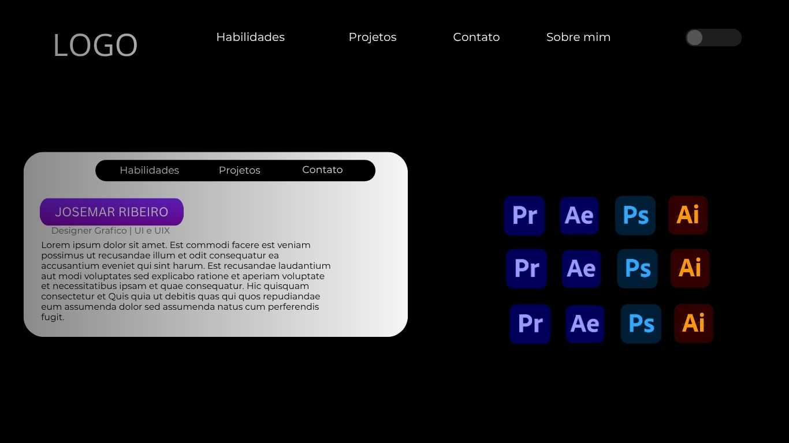
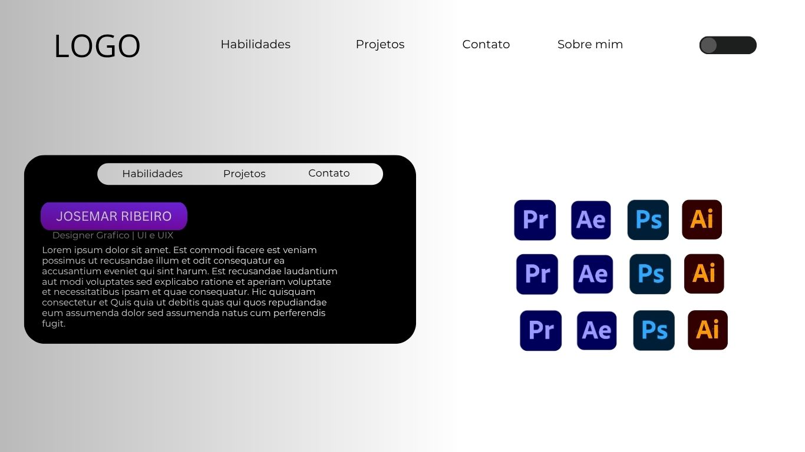

# Portfolio de Josemar Ribeiro

Este é um **site de portfolio interativo** criado para mostrar habilidades, projetos e informações pessoais de Josemar Ribeiro.  
O site possui um **modo claro e modo escuro** com um interruptor, além de cards responsivos e seções de skills.

---

## Funcionalidades

- Navbar com links para diferentes seções: Habilidades, Projetos, Contato.  
- Card principal com informações pessoais, título, subtítulo e descrição.  
- Seções de skills com logos de softwares utilizados (Photoshop, Illustrator, Premiere, After Effects).  
- **Dark Mode / Light Mode**: o usuário pode alternar entre temas usando o interruptor.  
- Design responsivo para dispositivos móveis e tablets.

---

## Tecnologias utilizadas

- **HTML5** – estrutura do site  
- **CSS3** – estilo, gradientes e responsividade  
- **JavaScript** – lógica para alternar o modo claro/escuro  
- **Google Fonts** – tipografias Montserrat e Great Vibes

---

## Modelo visual do site
 
 
